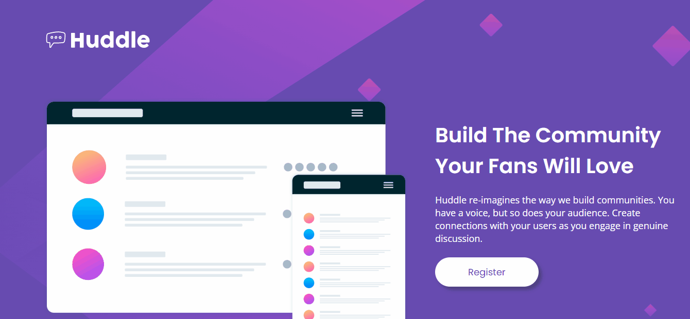
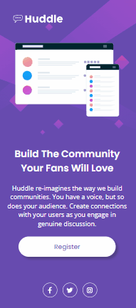

# Huddle landing page with single introductory section solution

This is a solution to the [Huddle landing page with single introductory section challenge on Frontend Mentor](https://www.frontendmentor.io/challenges/huddle-landing-page-with-a-single-introductory-section-B_2Wvxgi0). 

## Table of contents

- [Overview](#overview)
  - [The challenge](#the-challenge)
  - [Screenshot](#screenshot)
  - [Links](#links)
- [My process](#my-process)
  - [Built with](#built-with)
  - [What I learned](#what-i-learned)
  - [Continued development](#continued-development)

## Overview

### The challenge

Users should be able to:

- View the optimal layout for the page depending on their device's screen size
- See hover states for all interactive elements on the page

### Screenshot

Desktop version:

Mobile version:

### Links

- Live Site URL: [https://lrsslv.github.io/quest-html-css/]

## My process

### Built with

- Semantic HTML5 markup
- CSS custom properties
- Flexbox
- CSS Grid
- Mobile-first workflow

### What I learned

This project helped me to better understand and improve my flexbox and grid skills. As they are still quite challenging to me, I still have a lot to improve in future projects, but I ended up being happy with the results for now. 
It was really nice to build the responsive view and I believe that the results were good as everything look very similar to what the chalenge asks, and the hover functions works well.

### Continued development

As said before, I need to get more familiar with flexbox and grid concepts to be able to make my future projects even more responsive.

